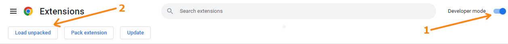

# System Web Theme Adaptor (Google Chrome Extension)

**Google Chrome Extension**

*Synchronise your system theme settings with web settings. 
Currently working only for ClickUp App*

This extensions automatically set **Dark / Light mode** on ClickUp - related to system theme settings.

  

---
## Installation
Currently this extensions **doesn't appear in Google Web store** but you can easily install it on your browser following these steps:

1. Download extension using **GitHub** or this link: [System Web Theme Adaptor](https://github.com/SatarisGIT/System-Web-Theme-Adaptor/archive/refs/heads/main.zip)
2. Unpack zip somewhere on your computer
3. Open page: <chrome://extensions/>
4. In upper right corner of page:
   1. Switch **Developer mode** to **ON** (no. 1 from image bellow)
   2. Click **Load unpacked** (no. 2 from image bellow)
   3. 
5. Find previously unpacked folder from .zip file on your computer and select it
6. Done